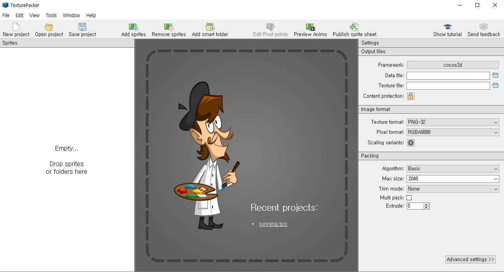
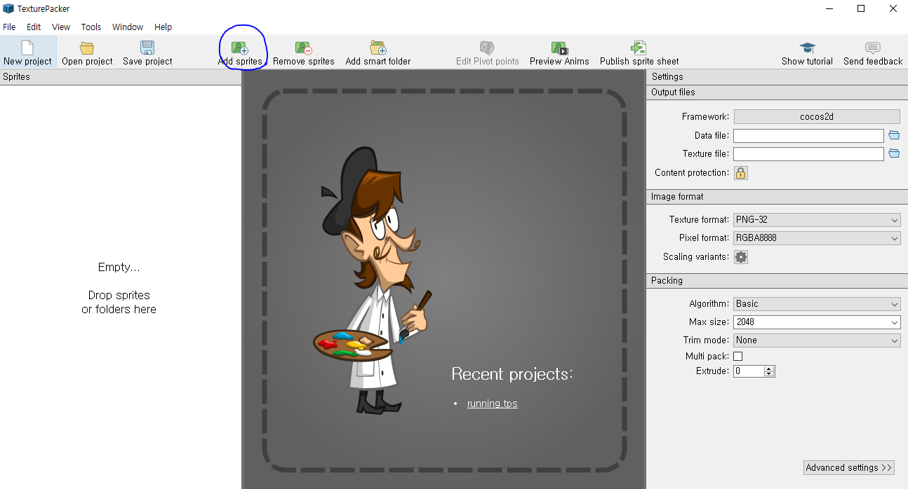
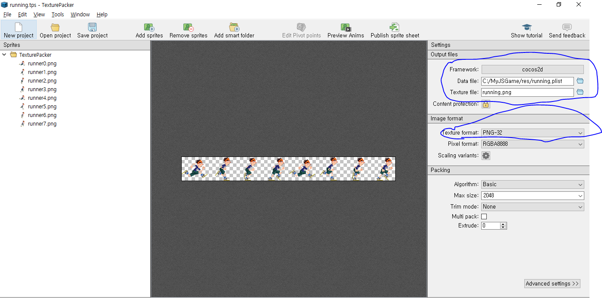
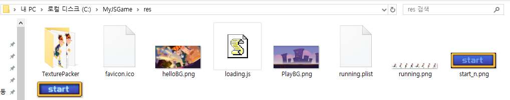

## cocos2d-js 로 파쿠르 게임 만들기!

### https://github.com/dalinaum/chukong-cocos-docs 를 보고 따라하는 중입니다.

### cocos2d-js 웹 TIP!

#### 파일의 변경사항이 적용이 안될떄
나는 크롬을 사용해 프로젝트를 실행시키는데, 저번부터 변경사항이 적용이 안되는 해프닝이 발생했는데, 다른 브라우저를 사용하면 잘 되다가도 크롬을 사용하면 안되는 이상한 일이 발생하곤 하였다.
그러다가 우연히 크롬의 인터넷 사용기록을 삭제하면 프로젝트의 변경사항이 적용된다는 것을 알았다. 아무래도 같은 도메인 주소면 크롬이 자동으로 쿠키와 비슷한 형식으로 파일의 이전내용을 저장한후 차후에 적용하여서 인것같다.
##### 그러니 만일 크롬에 코드의 변경사항이 적용이 안된다면 인터넷 사용기록을 삭제해보자!

### cocos2d의 개념
cocos2d는 Sprite(스프라이트),Layer(레이어),Scene(씬)으로 이루어져 있다.
Sprite는 하나의 개체 ex) 버튼, 글자, 이미지 등 으로 이루어져 있다.
이 스프라이트들을 합쳐 하나의 층을 만들수 있는데 그 층을 Layer라고 한다.
Layer는 적게는 하나에서 여러개의 스프라이트들로 이루어져 있다.
여러개의 Layer들이 합쳐져 하나의 씬이 구성되게 된다.
Scene은 하나의 장면을 뜻하는데, Scene들이 여러개가 합쳐져 게임이 만들어진다.
예를들어 게임 시작화면을 구성하기 위해 배경 Layer, 동작 Layer, 모션 Layer 를 필요로 한다면
배경 Layer에 이미지 Sprite를 넣고, 동작 Layer에 버튼과 Status Sprite를 넣으며, 모션 Layer에 모션 Sprite를 넣어 각 레이어를 완성시키고, 레이어들을 합쳐 Scene을 만들면 하나의 게임 화면이 완성되는 방식이다.

요약)

Scene Game Start [  Layer Background  {(Sprite(Image))}  +  Layer Status {(Sprite(button))+(Sprite(Text))}  + Layer Motion {(Sprite(Motion))}  ]

+

Scene ....

+

Scene ....

+

....

= 게임 완성!


### First Step!
1. src/resource.js 파일을 전부 지우고 다시 작성해 준다.
```javascript
var res = {
    helloBG_png : "res/helloBG.png",
    start_n_png : "res/start_n.png",
    start_s_png : "res/start_s.png"
};

var g_resources = [
    //image
    res.helloBG_png,
    res.start_n_png,
    res.start_s_png
];
```
resource.js 파일은 res파일에 있는 이미지를 불러오는데 쓰인다.

2. src/app.js 파일을 전부 지우고 다시 작성해 준다.

```javascript
var MenuLayer = cc.Layer.extend({
    ctor : function(){
        //1. super 클래스의 ctor function 불러온다.
        this._super();
    },
    init:function(){
        //super 클래스의 super function 을 불러온다.
        this._super();

        //2. 게임화면의 크기를 불러온다.
        var winsize = cc.director.getWinSize();

        //3. 중간지점을 지정해 준다.
        var centerpos = cc.p(winsize.width / 2, winsize.height / 2);

        //4. 3번의 중간지점을 이용해 이미지를 불러온다음 중간에 위치시킨다.
        var spritebg = new cc.Sprite(res.helloBG_png);
        spritebg.setPosition(centerpos);
        this.addChild(spritebg);

        //5.
        cc.MenuItemFont.setFontSize(60);

        //6.메뉴를 만든다음 onPlay 콜백 이벤트를 배치시킨다.
        var menuItemPlay = new cc.MenuItemSprite(
            new cc.Sprite(res.start_n_png), // normal state image
            new cc.Sprite(res.start_s_png), // select state image
            this.onPlay, this);
        var menu = new cc.Menu(menuItemPlay);  //7. create the menu
        menu.setPosition(centerpos);
        this.addChild(menu);
    },

    onPlay : function(){
        cc.log("==onplay clicked");
    }
});
```

#### 현재 모든 Layer를 완성시켰으니 이제 레이어들을 합쳐 Scene을 구성하면 된다.

3. Scene 만들기!

```javascript
var MenuScene = cc.Scene.extend({
    onEnter:function () {
        this._super();
        var layer = new MenuLayer();
        layer.init();
        this.addChild(layer);
    }
});
```
Scene이 생성되면 onEnter function을 선언해야 한다. Ctor fucntion 도 선언할 수 있고, 선언하게 된다면 onEnter function은 Ctor 다음에 실행된다.


### Second Step!
이제 초기 화면을 만들었으니 플레이 화면을 만들 차례다. 이번 장에서는 Start 버튼을 누르면 플레이화면으로 넘어가도록 만들것이다.

1. 플레이화면의 배경이미지와 캐릭터 이미지 다운받기!
https://github.com/dalinaum/chukong-cocos-docs/tree/master/tutorial/framework/html5/parkour-game-with-javascript-v3.0/chapter4/res
위의 링크에서 PlayBG.png 와 runner.png 이미지를 받는다.
그리고 res폴더안에 두개의 이미지를 넣는다.

2. 3개의 js 파일 만들기!
일단은 BackgroundLayer, AnimationLayer, StatusLayer 총 세개의 Layer를 만들것이며, 각 레이어들을 js 파일로 분리하고, PlayScene.js 파일로 Layer파일들을 합칠것이다.
src 폴더안에 BackgroundLayer.js , AnimationLayer.js, StatusLayer.js 총 세개의 파일과 PlayScene.js 파일을 만들어 넣어놓는다.

3. resource.js 파일 수정하기!
resource.js 파일은 res 폴더 안의 파일들을 불러오는데 쓰인다. 따라서 PlayBG.png 와 runner.png 이미지를 사용하기 위해서는 resource.js 파일을 통해 이미지를 불러와야 한다.
```javascript
var res = {
    helloBG_png : "res/helloBG.png",
    start_n_png : "res/start_n.png",
    start_s_png : "res/start_s.png",
    PlayBG_png  : "res/PlayBG.png",
    runner_png  : "res/runner.png"
};

var g_resources = [
    //image
    res.helloBG_png,
    res.start_n_png,
    res.start_s_png,
    res.PlayBG_png,
    res.runner_png
];
```
위와 같이 resource.js 파일을 수정하면 'res.파일이름' 을 통해 이미지를 사용할 수 있게 된다.

4. project.json 파일 수정하기!

project.json 파일은 게임을 실행시킬때 불러와야 할 파일들을 호출한다. 초기에는 app.js와 resource.js 파일밖에 불러올게 없었지만 이제 4개의 파일들이 추가되었기 떄문에 project.json을 통해 불러올 4개의 파일을 추가시켜야 한다.
```json
 "jsList" : [
        "src/resource.js",
        "src/app.js",
        "src/AnimationLayer.js",
        "src/BackgroundLayer.js",
        "src/PlayScene.js",
        "src/StatusLayer.js"
    ]
```
위와같이 jsList 에 불러올 파일의 경로를 적어주면 된다.

#### 코드 작성하기!
이제 우리가 만든 파일에 코드를 작성할 차례이다.

1. PlayScene.js 작성하기!

Background, Status, Animation Layer들이 모두 다른 파일으로 되어있기 떄문에 PlayScene.js 에서 addChild 메소드를 통해 하나로 합치면 된다.
```javascript
var PlayScene = cc.Scene.extend({
    onEnter:function () {
        this._super();
        //add three layer in the right order
        this.addChild(new BackgroundLayer());
        this.addChild(new AnimationLayer());
        this.addChild(new StatusLayer());
    }
});
```

2. BackgroundLayer.js 작성하기!
배경사진만 넣으면 되므로 이미지 Sprite 하나를 추가해주면 된다.
```javascript
var BackgroundLayer = cc.Layer.extend({
    ctor:function () {
        this._super();
        this.init();
    },

    init:function () {
        this._super();
        var winsize = cc.director.getWinSize();

        //create the background image and position it at the center of screen
        var centerPos = cc.p(winsize.width / 2, winsize.height / 2);
        var spriteBG = new cc.Sprite(res.PlayBG_png);
        spriteBG.setPosition(centerPos);
        this.addChild(spriteBG);
    }
});
```
app.js 에서 했던것처럼 화면의 중간위치를 구한다음, 이미지를 적용시키면 된다.

3. AnimationLayer.js 작성하기!
이 과정에서는 MoveTo 메소드를 이용해 runner.png를 (80,85) 위치에서 (300,85)로 이동시킬것이다.
```javascript
var AnimationLayer = cc.Layer.extend({
    ctor:function () {
        this._super();
        this.init();
    },
    init:function () {
        this._super();

        //create the hero sprite
        var spriteRunner = new cc.Sprite(res.runner_png);
        spriteRunner.attr({x: 80, y: 85});

        //create the move action
        var actionTo = new cc.MoveTo(2, cc.p(300, 85));
        spriteRunner.runAction(new cc.Sequence(actionTo));
        this.addChild(spriteRunner);
    }
});
```
spriteRunner를 생성한 후, 초기 위치를 x는 80 y는 85로 정해줬다.
그리고 actionTo 를 생성한 뒤에, runAction 메소드를 통해 spriteRunner에 적용시켰다.

4. StatusLayer.js 작성하기!
이 과정에서는 이미지가 아닌 텍스트를 이용해 HUD 정보를 띄울 것이다.
텍스트는 LabelTTF 메소드를 통해 생성할 수 있다.
LabelTTF는 cc.LabelTTF(글자,폰트,폰트사이즈,정의 등)으로 사용하면 된다.
```javascript
var StatusLayer = cc.Layer.extend({
    labelCoin:null,
    labelMeter:null,
    coins:0,

    ctor:function () {
        this._super();
        this.init();
    },

    init:function () {
        this._super();

        var winsize = cc.director.getWinSize();

        this.labelCoin = new cc.LabelTTF("Coins:0", "Helvetica", 20);
        this.labelCoin.setColor(cc.color(0,0,0));//black color
        this.labelCoin.setPosition(cc.p(70, winsize.height - 20));
        this.addChild(this.labelCoin);

        this.labelMeter = new cc.LabelTTF("0M", "Helvetica", 20);
        this.labelMeter.setPosition(cc.p(winsize.width - 70, winsize.height - 20));
        this.addChild(this.labelMeter);
    }
});
```


### 애니메이션 만들기!
이번에는 애니메이션을 작동시키는 법을 알아보자! 그전에 먼저 TexturePacker 라는 툴을 다운받아 놓는다.
TexturePakcer를 통해 애니메이션을 만드는 방법을 알아보겠다.

#### TexturePacker로 애니메이션 만들기!
먼저 https://github.com/dalinaum/chukong-cocos-docs/tree/master/tutorial/framework/html5/parkour-game-with-javascript-v3.0/chapter5/code/res/TexturePacker 이 주소를 통해 runner0 부터 runner07까지의 이미지를 모두 res/TexturePacker 폴더에 넣어준다.
그리고 TexturePakcer를 실행시킨다.


실행시킨 화면이다.

그 다음 파란색 동그라미 부분인 Add sprites를 눌러서 아까 받아놓은 이미지들을 불러온다.


마지막으로 아래의 그림을 보고 프레임워크와 경로, 이미지등을 설정하고, 위쪽의 Publish sprite sheet 버튼을 눌러준다.


그렇게 되면 경로를 설정한 곳에 다음과 같이 running.plist 와 running.png 가 만들어져 있을것이다.


### 코드 작성하기!
애니메이션을 만들었으니 이제 코드를 작성할 차례이다. 
1. 먼저 아까만든 running.plist 와 running.png 를 불러오는 코드를 추가한다.(resource.js에 추가)
```javascript
var res = {
    helloBG_png : "res/helloBG.png",
    start_n_png : "res/start_n.png",
    start_s_png : "res/start_s.png",
    PlayBG_png  : "res/PlayBG.png",
    runner_png  : "res/running.png",
    runner_plist : "res/running.plist"
};

var g_resources = [
    //image
    res.helloBG_png,
    res.start_n_png,
    res.start_s_png,
    res.PlayBG_png,
    res.runner_png,
    res.runner_plist
];
```
* 주의 : running.png 와 running.plist 를 runner_png 와 runner_plist로 바꿧기 때문에 코드를 작성할 때 유의하여야 한다.

2. AnimationLayer 작성하기
```javascript
var AnimationLayer = cc.Layer.extend({
    // 1 .변수 만들기
    spriteSheet:null,
    runningAction:null,
    sprite:null,
    ctor:function () {
        this._super();
        this.init();
    },

    init:function () {
        this._super();

        // sprite sheet 만들기
        cc.spriteFrameCache.addSpriteFrames(res.runner_plist);
        this.spriteSheet = new cc.SpriteBatchNode(res.runner_png);
        this.addChild(this.spriteSheet);


        // runningAction 초기화
        var animFrames = [];
        for (var i = 0; i < 8; i++) {
            var str = "runner" + i + ".png";
            var frame = cc.spriteFrameCache.getSpriteFrame(str);
            animFrames.push(frame);
        }

        var animation = new cc.Animation(animFrames, 0.1);  //aniFrames을 0.1 딜레이 주기
        this.runningAction = new cc.RepeatForever(new cc.Animate(animation));
        this.sprite = new cc.Sprite("#runner0.png");
        this.sprite.attr({x:80, y:85});
        this.sprite.runAction(this.runningAction);
        this.spriteSheet.addChild(this.sprite);
    }
});
```